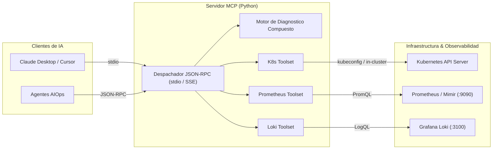

# Servidor MCP para Kubernetes y Observabilidad


Servidor de **Model Context Protocol (MCP)** desarrollado en Python que expone herramientas nativas de telemetria, estado de infraestructura y diagnostico automatizado para agentes autonomos de Inteligencia Artificial (Claude Desktop, Cursor, Copilots internos de SRE).

Permite que un modelo de lenguaje inspeccione clústeres de Kubernetes, consulte metricas mediante PromQL en Prometheus y analice trazas de registros en Grafana Loki para ejecutar analisis de causa raiz (RCA) de forma segura y estructurada.

---

## Arquitectura del Sistema



---

## Catalogo de Herramientas MCP

El servidor expone el siguiente conjunto de herramientas bajo el estandar MCP:

| Herramienta | Parametros | Descripcion Tecnica |
| :--- | :--- | :--- |
| `get_kubernetes_pods` | `namespace` (string) | Lista pods, fase de ciclo de vida (`Running`, `CrashLoopBackOff`, `OOMKilled`), estado de readiness y reinicios acumulados. |
| `get_cluster_events` | `namespace` (string) | Recupera eventos de advertencia y error del cluster (`BackOff`, `FailedScheduling`, `Unhealthy`). |
| `query_prometheus_metrics` | `query` (string) | Ejecuta consultas PromQL instantaneas para evaluar saturacion de CPU, memoria y tasas de error. |
| `query_loki_logs` | `query` (string), `limit` (int) | Ejecuta consultas LogQL contra Grafana Loki con soporte de filtros por servicio o nivel de log. |
| `diagnose_pod_health` | `pod_name` (string), `namespace` (string) | Herramienta compuesta que correlaciona estado del pod, consumo de memoria/CPU, eventos y logs de error para generar un diagnostico con puntuacion de salud (0-100) y acciones correctivas. |

---

## Modos de Operacion: Dual Mode

Para facilitar tanto la ejecucion en entornos de produccion como demostraciones interactivas sin dependencias externas, el servidor implementa soporte dual:

1. **Modo Mock (`MCP_MODE=mock`)**: Genera telemetria y eventos sinteticos con patrones reales de fallos en Kubernetes (CrashLoopBackOff, OOMKilled, cuellos de botella de memoria). Ideal para pruebas locales inmediatas, evaluacion de prompts de agentes y portafolio.
2. **Modo Live (`MCP_MODE=live`)**: Se conecta directamente a la API de Kubernetes (mediante archivo `kubeconfig` o ServiceAccount in-cluster), a Prometheus y a Grafana Loki mediante peticiones HTTP autenticadas.

---

## Requisitos Previos

- Python 3.10 o superior.
- Git.
- Docker (opcional, para ejecucion en contenedor).

---

## Instalacion y Puesta en Marcha

### 1. Clonar el Repositorio
```bash
git clone https://github.com/NeoScraids/mcp-k8s-observability.git
cd mcp-k8s-observability
```

### 2. Configurar Entorno Virtual y Dependencias
```bash
python -m venv venv

# En Linux / macOS:
source venv/bin/activate

# En Windows (PowerShell):
.\venv\Scripts\Activate.ps1

pip install -r requirements.txt
```

### 3. Configuracion de Variables de Entorno
Copia la plantilla de entorno:
```bash
cp .env.example .env
```

Variables disponibles:
```env
MCP_MODE=mock
PROMETHEUS_URL=http://localhost:9090
LOKI_URL=http://localhost:3100
KUBECONFIG=~/.kube/config
```

---

## Verificacion Local Inmediata

Ejecuta el cliente de prueba CLI para validar la comunicacion JSON-RPC y la respuesta de las 5 herramientas:

```bash
python test_client.py
```

Salida esperada:
```text
======================================================================
  1. INICIALIZACION MCP (initialize)
======================================================================
{
  "jsonrpc": "2.0",
  "id": 1,
  "result": {
    "protocolVersion": "2024-11-05",
    "capabilities": {
      "tools": {}
    },
    "serverInfo": {
      "name": "mcp-k8s-observability",
      "version": "1.0.0"
    }
  }
}
...
======================================================================
  5. EJECUTAR HERRAMIENTA: diagnose_pod_health (analytics-exporter)
======================================================================
Pod Objetivo:       analytics-exporter-4f11e9dc-pl45w
Puntuacion Salud:   30/100
Problemas Hallados: El pod fue terminado por superar el limite de memoria configurado (OOMKilled - Exit Code 137).
Acciones SRE:       Incrementar los limites de recursos en el Deployment (resources.limits.memory).
```

---

## Integracion con Claude Desktop

Para conectar este servidor a la aplicacion Claude Desktop, agrega la configuracion en tu archivo `claude_desktop_config.json`:

- **En macOS**: `~/Library/Application Support/Claude/claude_desktop_config.json`
- **En Windows**: `%APPDATA%\Claude\claude_desktop_config.json`

```json
{
  "mcpServers": {
    "k8s-observability": {
      "command": "python",
      "args": ["-m", "src.server"],
      "cwd": "/ruta/absoluta/a/mcp-k8s-observability",
      "env": {
        "MCP_MODE": "mock"
      }
    }
  }
}
```

---

## Construccion con Docker

Para empaquetar el servidor como imagen ligera lista para distribucion:

```bash
docker build -t neoscraids/mcp-k8s-observability:1.0.0 .
```

---

## Licencia

Distribuido bajo la licencia MIT. Consulta el archivo `LICENSE` para mayores detalles.
